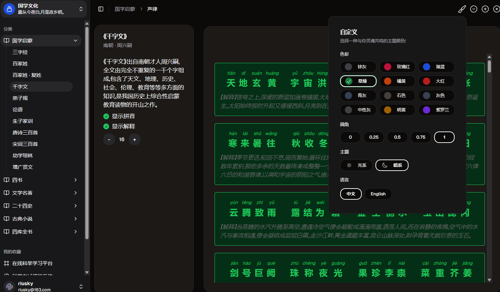
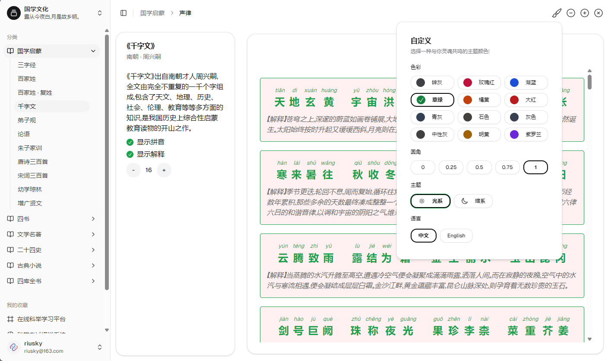
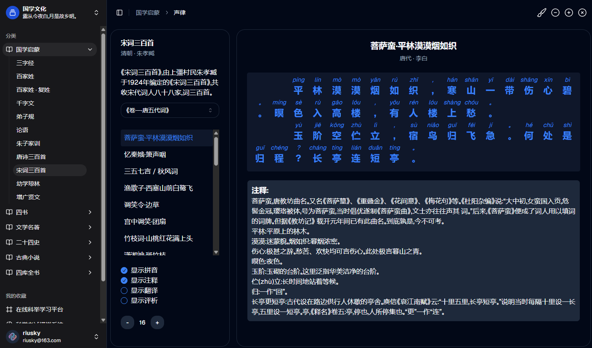

# OceanKiteEducation

> 海内存知己，天涯若比邻。  
> 鸢飞戾天者，望峰息心；经纶世务者，窥谷忘反。

## 海鸢 - OceanKite

OceanKiteEducation 是一个旨在提升教育教学质量的创新平台。  
我们的目标是通过提供高质量的教学资源和工具，帮助教师更有效地传授知识，激发学生的学习兴趣以及促进个性化学习。  
我们专注于整合现代科技与教育实践，以支持动态的和互动的学习体验。无论是课堂教学还是自学，我们都致力于为全球的教育者和学习者提供有价值的支持。

OceanKiteEducation is an innovative platform aimed at enhancing the quality of educational teaching.  
Our goal is to assist teachers in effectively delivering knowledge, inspire student engagement, and promote personalized learning by providing high-quality educational resources and tools.  
We focus on integrating modern technology with educational practices to support dynamic and interactive learning experiences.  
Whether for classroom teaching or self-study, we are committed to offering valuable support to educators and learners worldwide.

## 项目截图

### 截图1: 主界面



> 这是 OceanKiteEducation 的主界面，用户可以通过该界面进行功能切换和预览。

### 截图2: 主题切换



> 右上角提供主题和样式等切换，同时也增加多语言的配置。

### 截图3: 其他



> 这是简单的页面内容展示，目前还未集成本地大模型，持续优化中。

### 截图4: 互动教学工具

> 这部分正在开发过程中。
> 互动教学工具界面，学生可以通过这个工具与教师实时互动，进行问答和讨论。

## 开发计划

1. **2024年10月28日 - 2024年11月02日**: 完成软件基础的搭建，完成登录等权限接口
2. **2024年11月03日 - 2024年11月15日**: 实现课程管理和学习记录功能
3. **2024年11月16日 - 2024年11月30日**: 开发互动教学工具，实时问答功能
4. **2024年12月01日 - 2024年12月15日**: 完成学生学习评估系统，并整合AI辅助功能
5. **2024年12月16日 - 2024年12月31日**: 优化性能，进行测试并修复问题
6. **2025年1月开始**: 发布Beta版本

## 技术栈

OceanKiteEducation 的前端是基于 Vue.js 和 Shadcn UI 构建的，后端使用 Rust 和 Tauri 实现高性能的桌面应用。  
前端采用 Vue 3 结合 Shadcn UI 提供现代化、响应式的界面，后端则通过 Tauri 的轻量级包装结合 Rust 提供原生桌面体验。  
这使得我们的应用不仅具备跨平台能力，还能提供卓越的性能和安全性。

### 前端技术栈

- **Vue.js 3**: 作为主要的 JavaScript 框架，Vue 3 提供响应式的数据绑定和组件化的开发方式，帮助我们构建灵活且高效的用户界面。
- **Shadcn UI**: 采用 Shadcn UI 库进行界面设计，提供一套高质量的组件，快速构建现代化的用户界面。
- **Vue Router**: 用于前端路由管理，支持单页应用（SPA）以及动态页面切换。
- **Pinia**: 状态管理工具，取代 Vuex，提供更简洁、更高效的状态管理解决方案。
- **Axios**: 用于处理与后端服务器的 HTTP 请求，支持异步操作及请求拦截等功能。
- **Vite**: 构建工具，用于快速构建开发环境和生产环境应用，支持热更新 (HMR) 和快速编译。
- **ESLint & Prettier**: 代码规范工具，用于确保代码质量并统一代码风格。

### 后端技术栈

- **Rust**: 高性能的系统级编程语言，OceanKiteEducation 后端的核心部分使用 Rust 构建，具备极高的执行效率和内存安全性。
- **Tauri**: 轻量级的桌面应用框架，结合 Rust 与前端技术栈构建跨平台应用，支持 Windows、macOS 和 Linux。
- **Rocket**: 用于构建后端 API 的 Rust Web 框架，支持高效的请求路由、异步处理以及灵活的请求响应机制。
- **SQLx**: 用于与数据库进行异步交互的 Rust SQL 客户端，支持多种数据库，如 PostgreSQL、MySQL 等。
- **Serde**: Rust 的序列化/反序列化库，处理 JSON 数据的转换。
- **Diesel**: 用于数据库交互的 Rust ORM，提供类型安全的数据库查询。
- **tokio**: Rust 的异步运行时，用于构建高并发、高性能的后端服务。
- **Actix Web**: 另一个 Rust 的高效 Web 框架，适用于构建微服务架构以及高并发 API。

### 跨平台支持

- **Tauri**: 提供跨平台的桌面应用支持，确保 OceanKiteEducation 可以在 Windows、macOS 和 Linux 上运行。
- **WebAssembly (Wasm)**: 部分功能使用 WebAssembly 构建，进一步提升跨平台能力。
- **Electron**: 作为备用方案，Electron 用于开发桌面应用，但 Tauri 是我们的首选，因其更小巧且性能更好。

### 数据存储与缓存

- **SQLite**: 用于存储应用中的小型数据及本地配置，确保应用数据的持久化。
- **Redis**: 用于缓存和会话管理，提高响应速度，减少后端压力。
- **GraphQL**: 使用 GraphQL API，提供高效、灵活的数据查询接口，减少冗余数据的传输。
- **SurrealDB**: 使用 SurrealDB 本地嵌入式的数据库，结合 Rust 更好的管理本地数据。

### 测试与质量保障

- **Jest**: 用于 Vue 组件的单元测试，确保各个模块按预期功能运行。
- **Mocha & Chai**: 后端 API 测试框架，用于编写和执行 API 测试，确保后端逻辑的正确性。
- **Cargo Test**: Rust 语言的单元测试工具，用于后端模块的单元和集成测试。
- **Cypress**: 用于端到端测试（E2E），验证用户的交互流程是否按预期进行。
- **Prettier & ESLint**: 确保代码一致性，自动修复代码风格问题。

### 持续集成与部署

- **GitHub Actions**: 用于自动化 CI/CD 流程，确保每次提交或 PR 都会自动触发构建和测试。
- **Docker**: 提供跨平台的开发和部署环境，确保开发、测试、生产环境的一致性。
- **Heroku & AWS**: 用于托管后端 API 和数据库，保证应用的高可用性。
- **Vercel**: 用于托管前端应用，确保前端的高可用性和快速部署。

---

### 小结

通过这些前沿技术的组合，OceanKiteEducation 能够提供一个高效、稳定、跨平台的教育平台。我们期望利用现代技术为教育带来更多的可能性，为全球的教育者和学习者提供更好的体验。

## 安装与使用

### 安装依赖

1. 安装 [Node.js](https://nodejs.org/)
2. 安装 [Rust](https://www.rust-lang.org/)
3. 安装 [Tauri](https://tauri.app/)  
   使用以下命令安装 Tauri CLI:
   ```bash
   cargo install tauri-cli
   ```
4. 克隆项目
   克隆项目在本地运行:
   ```bash
   git clone git@github.com:riusky/OceanKiteEducation.git
   ```
5. 安装前端依赖
   ```
   cd OceanKiteEducation
   pnpm install
   ```
6. 构建并运行桌面应用
   ```
   pnpm tauri dev
   ```
7. 构建生产版本
   ```
   pnpm tauri build
   ```
